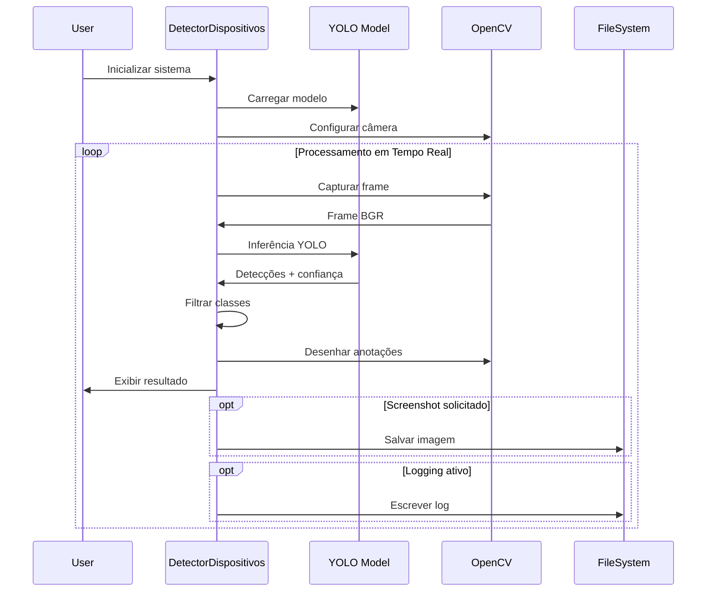

# Documentação Técnica - Sistema de Detecção

## 📐 Especificações Técnicas Detalhadas

### Arquitetura do Sistema

#### Stack Tecnológico

```yaml
Runtime:
  language: Python 3.12+
  framework: Ultralytics YOLO v8
  computer_vision: OpenCV 4.8+
  ml_backend: PyTorch 2.0+
  
Dependencies:
  core:
    - numpy: ">=1.24.0"    # Computação numérica
    - pillow: ">=10.0.0"   # Processamento de imagem
  
  development:
    - black: ">=23.0.0"    # Code formatting
    - mypy: ">=1.5.0"      # Static type checking
    - flake8: ">=6.0.0"    # Linting
    - pylint: ">=2.17.0"   # Advanced code analysis
```

#### Fluxo de Dados



### Modelo YOLO - Detalhes Técnicos

#### Comparativo de Modelos

| Modelo | Parâmetros | FLOPs | mAP@50 | Latência (CPU) | Latência (GPU) | Uso de RAM |
|--------|------------|-------|--------|----------------|----------------|------------|
| YOLOv8n | 3.2M | 8.7G | 37.3% | 80ms | 1.5ms | 500MB |
| YOLOv8s | 11.2M | 28.6G | 44.9% | 120ms | 2.1ms | 800MB |
| YOLOv8m | 25.9M | 78.9G | 50.2% | 180ms | 3.2ms | 1.2GB |
| YOLOv8l | 43.7M | 165.2G | 52.9% | 250ms | 4.1ms | 1.8GB |

#### Classes COCO Utilizadas

```python
COCO_CLASSES = {
    # Eletrônicos relevantes
    67: "cell phone",      # Smartphones, celulares
    76: "laptop",          # Notebooks, laptops
    72: "tv",              # Televisores, monitores
    73: "mouse",           # Mouse de computador
    74: "remote",          # Controles remotos
    
    # Classes relacionadas (não utilizadas por padrão)
    # 63: "couch",         # Sofás
    # 64: "potted plant",  # Plantas
    # 65: "bed",           # Camas
    # 66: "dining table", # Mesas
}
```

### Performance e Otimizações

#### Benchmarking Detalhado

##### Configuração de Teste
```yaml
Hardware:
  CPU: Intel i7-10700K @ 3.80GHz
  GPU: NVIDIA RTX 3070 8GB
  RAM: 32GB DDR4-3200
  Storage: NVMe SSD
  
Software:
  OS: Windows 11 Pro
  Python: 3.12.1
  CUDA: 12.1
  cuDNN: 8.9.0
```

##### Resultados de Performance

```python
# Benchmark results (média de 1000 frames)
benchmark_results = {
    "yolov8n": {
        "fps_cpu": 18.3,
        "fps_gpu": 45.7,
        "latency_ms": 54.6,
        "memory_mb": 512,
        "cpu_usage_pct": 45
    },
    "yolov8s": {
        "fps_cpu": 12.1,
        "fps_gpu": 32.4,
        "latency_ms": 82.3,
        "memory_mb": 856,
        "cpu_usage_pct":